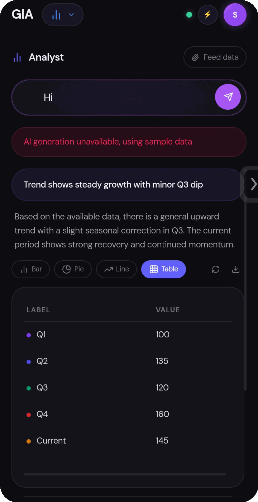
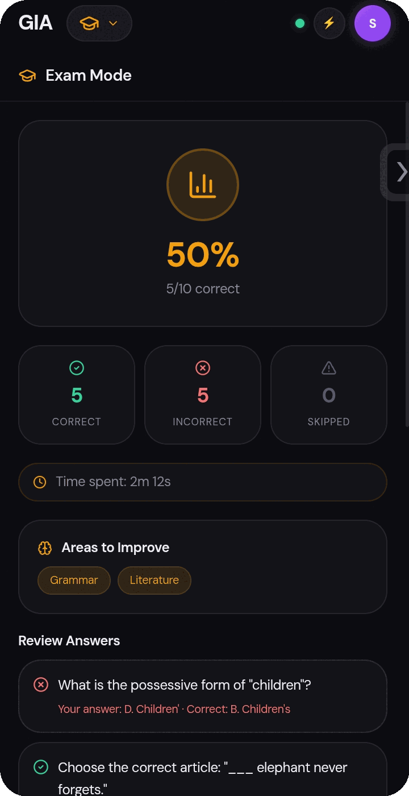
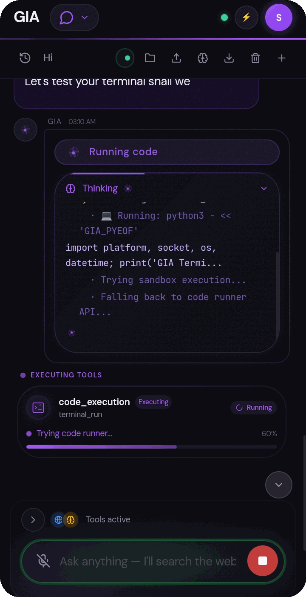
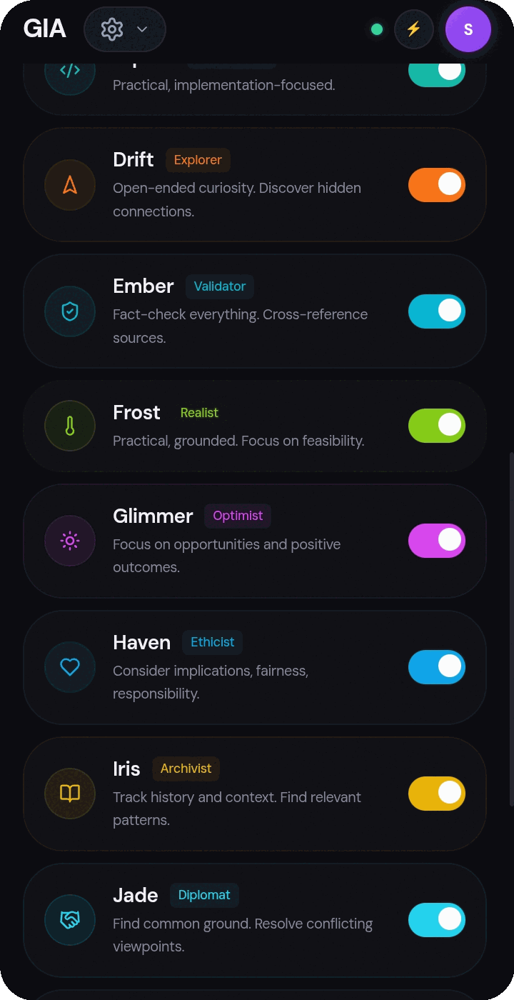
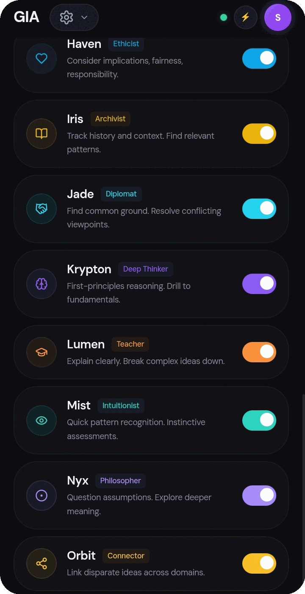

# GIA v2.3.3.0-beta.1 — Generative Interface Agent

<div align="center">


[](https://github.com/alpha-1-design/gia-app/actions/workflows/ci.yml)
[]()
[](LICENSE)
[](package.json)
[](capacitor.config.ts)
[](https://www.typescriptlang.org/)
[](https://reactjs.org/)
[]()
[]()
[]()
[]()
[]()

**GIA (Generative Interface Agent)** — private, on-device AI workspace. No backend, no telemetry, no cloud dependency except the AI API calls you configure.

> **v2.3.3.0-beta.1** — This is our most stable release yet, with a few UI improvements too.

[Explore Manual](./manual.md) · [Report Bug](./gia-bug-report.md) · [Contributing](./CONTRIBUTING.md)

</div>

---

## 🌌 The Vision — GIA Everywhere

GIA started as an app. It's about to stop being just an app.

You've got GIA in your pocket today. **GIA Desktop is coming** — same brain, bigger canvas, a real workspace you actually sit down and build in. And the magic? They sync. Phone to desktop, desktop to phone — your memory, your agents, your context, trailing along like they always should have. Start something on the bus, finish it at your desk, and GIA just… knows.

But we're not stopping at two screens.

- **GIA CLI** — a terminal-native GIA for people who live in the shell, that writes, runs, and ships code with you.
- **GIA Watch** — your assistant on the wrist, surfacing context before you even ask.
- **GIA Car** — hands-free, eyes-on-the-road GIA that runs your life while you drive.
- **GIA Phone** — yeah, maybe we build the whole phone one day. Why not.
- **GIA Everything** — the long game: one continuous intelligence woven through every device you own, not *on* them but *part* of them.

They've not seen this one before. They won't see this one coming.

GIA isn't a chatbot. It's the start of something packed, powerful, and everywhere — including right here, in this app, today.

---

## 📸 Screenshots

<table>
<tr>
<td align="center" width="33%">
<br/>
<sub><b>Analyst — Bar View</b></sub>
</td>
<td align="center" width="33%">
<br/>
<sub><b>Analyst — Line View</b></sub>
</td>
<td align="center" width="33%">
<br/>
<sub><b>Analyst — Pie View</b></sub>
</td>
</tr>
<tr>
<td align="center" width="33%">
<br/>
<sub><b>Analyst — Table View</b></sub>
</td>
<td align="center" width="33%">
<br/>
<sub><b>Exam Mode — Results & Review</b></sub>
</td>
<td align="center" width="33%">
<br/>
<sub><b>Chat — Agentic Tool Use</b></sub>
</td>
</tr>
<tr>
<td align="center" width="33%">
<br/>
<sub><b>Live Terminal Execution</b></sub>
</td>
</tr>
</table>

---

## 🧑‍🤝‍🧑 Agent Personas

GIA ships with a bench of 20 distinct agent personas, each with its own reasoning style, tone, and role. You can toggle any combination on for a given task — e.g. `Onyx` (Skeptic) + `Ember` (Validator) to stress-test an idea, or `Flux` (Creative) + `Astra` (Strategist) to brainstorm and then structure a plan.

| Persona | Role | Focus |
| :--- | :--- | :--- |
| **Atlas** | Researcher | Thorough, detail-oriented. Gathers comprehensive data and verifies sources. |
| **Nova** | Analyst | Critical, logical. Breaks down problems and identifies patterns. |
| **Onyx** | Skeptic | Challenges assumptions. Finds flaws and edge cases. |
| **Flux** | Creative | Lateral thinking. Generates novel approaches and connections. |
| **Vex** | Synthesizer | Merges ideas. Combines findings into cohesive insights. |
| **Astra** | Strategist | Big-picture thinking. Prioritizes and plans. |
| **Bolt** | Critic | Sharp but constructive. Finds weaknesses and improvements. |
| **Cipher** | Technologist | Practical, implementation-focused. |
| **Drift** | Explorer | Open-ended curiosity. Discovers hidden connections. |
| **Ember** | Validator | Fact-checks everything. Cross-references sources. |
| **Frost** | Realist | Practical, grounded. Focuses on feasibility. |
| **Glimmer** | Optimist | Focuses on opportunities and positive outcomes. |
| **Haven** | Ethicist | Considers implications, fairness, responsibility. |
| **Iris** | Archivist | Tracks history and context. Finds relevant patterns. |
| **Jade** | Diplomat | Finds common ground. Resolves conflicting viewpoints. |
| **Krypton** | Deep Thinker | First-principles reasoning. Drills to fundamentals. |
| **Lumen** | Teacher | Explains clearly. Breaks complex ideas down. |
| **Mist** | Intuitionist | Quick pattern recognition. Instinctive assessments. |
| **Nyx** | Philosopher | Questions assumptions. Explores deeper meaning. |
| **Orbit** | Connector | Links disparate ideas across domains. |

<table>
<tr>
<td align="center" width="33%">

</td>
<td align="center" width="33%">

</td>
<td align="center" width="33%">

</td>
</tr>
</table>

---

## 🚀 Tech Stack

| Category | Technologies | Status |
| :--- | :--- | :--- |
| **Frontend** | React 18, TypeScript 5.7, Tailwind CSS, Framer Motion | ✅ Stable |
| **State** | Zustand (persisted to IndexedDB via `idb-storage`) | ✅ Stable |
| **Mobile Shell** | Capacitor (Android WebView) | ✅ Stable |
| **Build** | Vite | ✅ Stable |
| **Charts** | Recharts | ✅ Stable |
| **Diagrams** | Mermaid (loaded on-demand from CDN) | ✅ Stable |
| **Math** | KaTeX (loaded on-demand from CDN) | ✅ Stable |
| **Wake Word** | Porcupine by Picovoice (on-device DNN, no audio leaves the phone) | ✅ Stable |
| **Circle-to-Search** | Native Android Accessibility Service bridge for system-wide screenshot capture | 🧪 In Development |
| **Screen Agent** | Structured on-screen content reading (text, elements, app name, URL) | 🧪 In Development |
| **Cross-Device Mesh** | P2P state sync across Electron / browser / Android / extension | 🧪 In Development |

---

## 🤖 Supported Providers (18+)

GIA connects directly to provider APIs — no proxy, no middleman. All providers support OpenAI-compatible chat completions unless noted. Models are dynamically fetched from each provider's API; fallback model lists are bundled for offline-first startup.

### Cloud Providers

| Provider | Type | API Format | Key Models |
|----------|------|-----------|------------|
| **OpenAI** | General | `openai` | GPT-4o, GPT-4o-mini, o1, o3, o4-mini |
| **Anthropic** | General | `anthropic` | Claude Sonnet 4, Claude Haiku 3.5 |
| **Google Gemini** | General | `gemini` | Gemini 2.5 Flash (free), 2.5 Pro |
| **OpenRouter** | Aggregator | `openai` | 200+ models — Gemma 3 27B (free), GPT-4o, DeepSeek, Llama |
| **Groq** | High-speed | `openai` | Llama 3 70B (free), Mixtral 8x7B, Gemma 2 9B |
| **DeepSeek** | General | `openai` | DeepSeek V3, DeepSeek R1 |
| **Mistral AI** | General | `openai` | Mistral Small/Large, Pixtral Large (vision) |
| **xAI (Grok)** | General | `openai` | Grok 2, Grok Vision |
| **Together AI** | Hosted | `openai` | Llama 3.3 70B, DeepSeek V3, 100+ open models |
| **Perplexity** | Search-native | `openai` | Sonar Pro, Sonar Deep Research |
| **Cohere** | Enterprise | `openai` | Command R+, Command R |
| **Fireworks AI** | Fast inference | `openai` | Llama 3.3 70B, DeepSeek R1, 40+ models |
| **DeepInfra** | Hosted | `openai` | Llama 3.1 70B, Qwen 2.5 72B |
| **Cerebras** | Ultra-fast | `openai` | Llama 3.1 8B (free), Llama 3.3 70B (free) |
| **AI21 Labs** | General | `openai` | Jamba 1.5 Mini (256k ctx), Jamba 1.5 Large |
| **Replicate** | Hosted | `openai` | Llama 3 70B, 100+ open-source |
| **NVIDIA NIM** | Enterprise | `openai` | Nemotron Ultra 253B, Llama 3.3 70B, DeepSeek R1, Mistral Large |
| **HuggingFace** | Hosted | `huggingface` | Qwen 2.5 72B, Mistral 7B, 100k+ models |
| **OpenCode Zen** | Coding | `openai` | DeepSeek V4 Flash (free), GPT-4o Mini |

### Local / On-Device Providers

| Provider | Type | Details |
|----------|------|---------|
| **Ollama** | Local | Connect to any Ollama instance at `localhost:11434` — Llama 3.2, Gemma 3, Phi-4 |
| **LM Studio** | Local | Connect to LM Studio server at `localhost:1234` |
| **Local LLM** | On-device | Runs **Qwen2.5** (0.5B–3B) directly in-browser via Transformers WASM — fully offline |

### Image Generation Providers

- **OpenAI** — DALL-E 3
- **OpenRouter** — DALL-E 3, Stable Diffusion, FLUX
- **NVIDIA NIM** — Sana 4K, SDXL

---

## 🎙 Wake Word System (Proposed)

> **Status: Proposed** — architecture designed, Android service scaffolding in place, full implementation in progress. The wake word engine and native service code exist in the repository but require additional testing and polish before production use.

GIA will use **Porcupine** by Picovoice — an on-device deep neural network wake word engine:

- **100% offline** — all audio processing stays on your phone. No audio data is ever sent to any server.
- **Foreground Service** — on Android, GIA runs a persistent foreground service with a notification, keeping the wake word detector alive even when the app is backgrounded.
- **Auto-restart** — after a device reboot, the wake word service automatically restarts via `BOOT_COMPLETED` receiver.
- **Porcupine DNN** — trained on real-world environments with 97%+ accuracy. Adjustable sensitivity (0–1) to tune false positives vs. misses.
- **Custom wake word** — the shipped fallback uses `JARVIS` (a free built-in Porcupine keyword for testing). To use a custom "Hey GIA" model, train one at [Picovoice Console](https://console.picovoice.ai/) and place the `.ppn` file in `android/app/src/main/assets/`.

### Why `JARVIS` appears in the code

Porcupine ships with free built-in keywords (`HEY_GOOGLE`, `COMPUTER`, `ALEXA`, `JARVIS`, etc.) for development/testing without training a custom model. The code uses `JARVIS` as the default keyword. The JS configuration on the settings page still shows "hey gia" — the two are independent:
- The **JS-side** wake word ("hey gia") is used by the browser-based fallback (regex on STT transcript)
- The **native** Porcupine keyword (`JARVIS`) is used by the Android foreground service
- Once a custom "Hey GIA" `.ppn` model is trained and deployed, Porcupine switches to it automatically

### UX Flow — What happens when you say "Hey GIA" (planned)

1. Porcupine's DNN processes the live audio stream (16kHz, on-device)
2. On detection → the foreground service fires a `wakeWordDetected` event to GIA's WebView
3. A short **audio beep** plays (880 Hz sine tone, 150ms)
4. A notification "Wake word detected" appears in the UI
5. GIA immediately starts a **speech-to-text session** to capture your command
6. The transcribed text is **polished** (grammar, punctuation) via AI
7. The polished text appears in the chat input field
8. GIA processes the query autonomously

*Note: a full-screen voice overlay with animated waveform (similar to Siri/Gemini) is planned for a future release.*

---

## ✨ Features

| Area | Details |
|------|---------|
| **Agentic Loop** | Autonomous reasoning with multi-turn tool execution, sub-agent delegation |
| **Live Reasoning** | Real-time streaming thought panel during generation |
| **Deep Memory** | On-device persistent memory with relevance scoring, auto-extraction, pinning, and manual fact management |
| **Custom Instructions** | User-defined rules injected into every conversation system prompt |
| **Voice** | Push-to-talk, transcript polishing, TTS (wake-word proposed) |
| **Web Search** | DuckDuckGo with formatted citations and clickable source badges |
| **File Operations** | Read/write files (native + desktop), ZIP bundling, download triggers (browser) |
| **Code Execution** | Run Python/JS/C++ via Piston API, auto-fix on error |
| **Image Generation** | DALL-E 3 / OpenRouter image models, inline display in chat |
| **Skills System** | Role-based presets (Tutor, Developer, Researcher, Creative, Security) |
| **Knowledge Manager** | Browse, search, filter, pin, add, delete, import, export memories |
| **Conversation Search** | Search across session titles and message content with match count |
| **Autonomous Goals** | Create goals → auto-decompose → execute steps → reflect on outcomes |
| **Conversation Branching** | Tree-based branching and forking from any message |
| **MCP Support** | Model Context Protocol — extend tools via external MCP servers (SSE/stdio) |
| **Plugin System** | Hook-based plugin architecture with tool registration API |
| **Scheduled Tasks** | Hourly/daily/weekly background AI task execution |
| **Brain Export/Import** | Full memory backup and restore as JSON |
| **Deep Links** | `gia://` and `web+gia://` protocol handling |
| **PWA Share Target** | Receive shared content from other apps |
| **Clipboard Monitor** | Detects copied text with "Ask GIA" toast |
| **Clarification System** | Structured Q&A when input is ambiguous |
| **Protocol System** | Tool execution approval workflow (auto-confirm low-risk, require OK for high-risk) |
| **Extended Thinking** | Configurable reasoning budget for o1/o3/o4-mini and Gemini models |
| **Input Guardrails** | Prompt injection detection, dangerous command blocking, URL safety checks |
| **Output Validation** | Auto-repair malformed JSON, missing fences, repeated text patterns |
| **Smart Fallback** | Automatic provider failover based on latency/error tracking |
| **Response Caching** | Cache identical requests to reduce API costs |
| **Notes System** | Full sticky notes with colors, tags, pinning, search, and AI-manageable CRUD |
| **On-Device Local AI** | Text classification, summarization, translation, embeddings, and QA — all in-browser, no API call needed |
| **On-Device LLM** | Run Qwen2.5 generative LLMs (0.5B–3B) locally via Transformers WASM — full text generation offline |
| **On-Device Python (Pyodide)** | Run Python code locally via Pyodide WASM — no server required |
| **On-Device Vision** | Local image captioning, OCR, object detection, and classification + automatic provider fallback |
| **Setup Wizard** | First-run onboarding with step-by-step provider setup, API key entry, and connection testing |
| **Native Device Integration** 🧪 | Make calls, send SMS/WhatsApp/email, share content, read/write clipboard, trigger vibration — *calling/SMS experimental* |
| **Social Media Manager** | Post, schedule, and analyze across 7 platforms (X, Instagram, Facebook, LinkedIn, TikTok, Telegram, WhatsApp) with OAuth |
| **API Gateway** | Configurable HTTP proxy with route management, logging, rate limiting, and caching |
| **Connector System** | 11 pre-built API connectors (OpenWeatherMap, GitHub, Twilio, Supabase, etc.) with key management |
| **Telegram Channel Integration** | Full Telegram bot channel management — post text, photos, fetch stats |
| **Provider Health Monitoring** | Per-model latency, success rate, degradation detection with live Engine Room status |
| **JSON Retry System** | Exponential backoff + output validation for LLM JSON parsing failures |
| **Auto-Summarization** | Automatic conversation history compression when approaching context limits |
| **Offline Queue** | Persistent tool call queue — queues requests when offline, auto-replays on reconnect |
| **GitHub Integration** | Fetch GitHub user profiles, repos, files, and metadata directly from chat |
| **Biometric Lock** | Optional fingerprint / face unlock via native biometric API |
| **Device Health** | Storage, battery, memory monitoring with risk alerts |
| **Directions & Maps** 🧪 | Turn-by-turn routing (OSRM) with interactive map rendering — *experimental* |
| **Memory CRUD Tools** | `save_memory`, `forget_memory` with category filtering |
| **Build Project** | Scaffold, build, and package code projects into download-ready ZIP |
| **Install Skill** | Dynamically install skill definitions from URL or built-in registry |
| **Module Resilience** | Exam/Planner/Analyst modules auto-save state to localStorage — survive navigation, use cached/fallback data when offline |
| **Network-Aware Retry** | `generateWithRetry` detects offline state, waits for reconnection, provides clearer error messages with provider-switch hints |
| **Scheduled Post Auto-Publish** | SchedulerService checks and publishes due social posts automatically |
| **Autonomy Hanging Detection** | ProactiveEngine marks steps stuck >5min as failed, reduces check interval to 30s |
| **Granular Notifications** | Schedule, cancel, list, and check permissions for native push notifications |
| **Geolocation Tools** | Watch position, clear watch, check/request permissions |
| **Haptic Patterns** | Impact, notification, and vibration haptic feedback types |
| **Gateway Daemon** | Background daemon for continuous gateway operations |
| **Terminal Management** | Check status and kill proot terminal sessions |
| **Alpine Sandbox** | Full Linux sandbox environment via Docker/proot — install packages, run scripts, execute commands in isolated Alpine container |
| **Camera Capture** | Take photos via device camera (Capacitor) and feed them to GIA's vision models |
| **File Generation** | Generate PDF, DOCX, PPTX, and ZIP files from markdown/content — download or preview inline |
| **Document Reader** | Extract text from PDF, DOCX, PPTX files using Python-based parsing — preview content in chat |
| **Browse Web** | Full browser automation via Node.js server — navigate pages, extract content, interact with JS-rendered sites |
| **GIA Identity** | Configurable name, personality (Warm/Professional/Witty/Direct/Custom), tone (casual/formal/technical/poetic/academic/playful), focus areas, and proactiveness slider |
| **Long-Running Mode** | Prevents screen dimming and browser tab suspension with screen wake lock and background heartbeat |
| **Auto-Unload Idle Models** | Automatically unloads Whisper, Vision, and local LLM models after 10 minutes of inactivity to free memory |
| **On-Device Whisper** | Download local Whisper ONNX model (~50MB) for offline speech-to-text — toggle between local and browser STT |
| **Wake Word Diagnostics** | Service status badges, mic permission indicator, model loaded indicator, test button with detection event log |
| **Vision Model Management** | UI to list, download, manage ONNX vision models (captioning, OCR, detection, classification) with confidence threshold and provider fallback toggle |
| **Code Execution Settings** | Custom Piston API endpoint and API key configuration with test connection and language listing |
| **Code Run History** | View full history of code executions (language, timestamp, exit code, code snippet) with clear option |
| **Search Provider Config** | Configure Exa Search and Browserless.io API keys with active provider switching |
| **Brain Cloud Backup** | Sync brain to any WebDAV or S3-compatible endpoint with configurable URL and credentials |
| **Calendar Integration** | Full Google Calendar CRUD via OAuth — list, create, update, delete events with 6 dedicated tools |
| **Email Integration** | Full Gmail read/send via OAuth — connect, send, list, read, search with 7 dedicated tools |
| **Messaging Platforms** | WhatsApp and Telegram messaging integration with mention-only mode and platform status monitoring |
| **Reminders & Music** | Set reminders and play music through tool commands |
| **Plugin Management UI** | Install plugins from URL or file upload, enable/disable with manifest validation |
| **Custom Skill Editor** | Create custom skills with editable name, system prompt, and tool assignment toggles |
| **Memory Browser** | Inline memory viewer in settings with search, category color coding, and bulk delete |
| **Sandbox Package Management** | Install packages via apk, clone git repos, and manage sandbox filesystem |
| **RAG Document Listing** | List all indexed RAG documents with `rag_list_docs` tool |
| **File Editing** | Edit existing generated documents (PDF, DOCX, PPTX) |
| **Proactive Background Engine** | Generates time-aware greetings, contextual suggestions, and personality-driven messages during idle time |
| **Full Autonomy Mode** | When enabled, GIA executes all tools without requiring user approval — per-tool auto-approval configuration |
| **Developer Settings** | Token usage display, console log level selector, HuggingFace token input, network monitor, cache management |
| **Session Summarization** | Tracks session summarization history for efficient context window management |
| **No-API-Key Banner** | Clickable banner redirects to Settings when no API keys are configured |

## 🔌 Any-Endpoint Connectivity

GIA can connect to **any reachable TCP/UDP endpoint** — remote servers, databases, IoT devices, TVs, APIs, WebSocket services, and more:

### TCP/UDP Connections

| Tool | What it does |
|------|-------------|
| `network_scan` | Scan TCP ports on any host (`host`, `ports` like `"22,80,443"` or `"1-1000"`) |
| `network_connectivity` | Test if a `host:port` is reachable (TCP or UDP) |
| `network_detect` | Auto-scan local subnet for open services (SSH, HTTP, MySQL, Postgres, Redis, etc.) |
| `ssh_connect` | SSH into any remote machine and execute commands (password or key auth) |
| `ssh_add_key` | Store SSH private keys for key-based authentication |
| `ssh_list_connections` | List saved SSH connections and keys |
| `ssh_remove_connection` | Remove a saved SSH connection |

### Database Connections

| Tool | What it does |
|------|-------------|
| `db_query` | Execute SQL on PostgreSQL, MySQL, or SQLite (`type`, `query`, connection params) |
| `db_configure` | Save a database connection for reuse (credentials stored locally) |
| `db_list_connections` | List saved database connections |
| `db_remove_connection` | Remove a saved DB connection |

### WebSocket Connections

| Tool | What it does |
|------|-------------|
| `ws_connect` | Connect to any WebSocket endpoint (`url`) |
| `ws_send` | Send a message through an active WebSocket |
| `ws_receive` | Read pending messages (non-blocking) |
| `ws_wait` | Block until a message arrives (with timeout) |
| `ws_close` | Close a WebSocket connection |
| `ws_status` | Check all active WebSocket connections |

Connections are **persistent**: SSH keys, database credentials, and WebSocket connections survive page reloads. GIA can discover, probe, and connect to any endpoint it can reach on the network.

---

## 📁 Persistent File Store

GIA includes a **permanent file storage system** for all uploaded files — images, documents, code, and data:

- **Persistent storage**: All uploaded files are stored in IndexedDB and survive app restarts
- **File Manager UI**: Open from the chat toolbar — browse in grid/list view, search by name/tag/content, preview inline
- **Tagging**: Add/remove tags to organize files
- **Source tracking**: Files tagged by source — `chat_upload`, `manual`, `capture`
- **Drag-and-drop**: Drop files directly into the File Manager
- **Camera capture**: Take photos directly from the File Manager
- **Full preview**: View images inline, read document content (text, code, PDF)

### File Tools for GIA

| Tool | What it does |
|------|-------------|
| `file_search` | Search files by name, type, tags, or full-text content |
| `file_get` | Retrieve full content (text or image data URL) by file ID |
| `file_list` | List all files, optionally filtered by source |
| `file_delete` | Permanently delete a file |
| `file_tag` | Add or remove tags on a file |

Files uploaded in any chat session are visible in the File Manager and searchable by GIA across all sessions. GIA can reference any uploaded file at any time using `file_search` + `file_get`.

---

## 🎨 Display Capabilities

GIA can render **anything** in chat — charts, 3D, maps, diagrams, math, images, terminals, and rich interactive visual blocks:

### Interactive Visual Blocks

Rendered from ` ```visual ` code blocks (GIA generates these automatically):

| Type | Tag | Example |
|------|-----|---------|
| **Charts** | `chart` | Bar, line, pie, area, radar charts via Recharts |
| **Data Tables** | `table` | Sortable, copyable data tables with pagination |
| **Mind Maps** | `mindmap` | Tree/radial diagrams |
| **Timelines** | `timeline` | Chronological event displays |
| **Code Diffs** | `diff` | Side-by-side code comparison |
| **Image Galleries** | `gallery` | Grid image layouts |
| **Terminal Output** | `terminal` | ANSI-colored terminal output |
| **Metric Widgets** | `widget` | KPI metric cards |
| **Document Outlines** | `outline` | Tree/table-of-contents views |
| **Maps** | `map` | Interactive Leaflet/OpenStreetMap |
| **Audio Waveforms** | `waveform` | Audio visualization |
| **3D Objects** | `graph` | Network graphs, force-directed layouts, 3D visualizations |
| **3D Scenes** ⚗️ | `scene` | **Experimental** — AI-generated 3D scenes via Three.js (objects, lighting, materials, animation). Ask GIA to "generate a 3D scene" or "render a 3D [object/environment]" |

### Markdown Rendering

| Feature | Support |
|---------|---------|
| **Mermaid diagrams** | ` ```mermaid ` renders as SVG (flowcharts, sequence, Gantt) |
| **KaTeX math** | `$...$` and `$$...$$` rendered beautifully |
| **SVG inline** | ` ```svg ` renders live SVG |
| **Task lists** | `- [x]` checkable checkboxes |
| **Collapsible sections** | `<details><summary>` expand/collapse |
| **Tables** | Rich tables with copy button and row hover |
| **Footnotes** | `[^1]` references with back-links |
| **Definition lists** | `term` / `: definition` rendering |
| **Images** | `` inline display |
| **Inline code** | Click-to-copy with visual feedback |
| **Highlight** | `==text==` for highlighted spans |
| **Colored spans** | `<span style="color:...">` inline HTML |

### UI Improvements

- Floating stop button during generation
- Phase badges: Thinking… → Generating… → Done
- Model footprint on assistant messages (`via gpt-4o`)
- Streaming cursor (blinking `▋`) during token delivery
- Transparent input area with backdrop blur
- Empty state spacing for new chats
- **Context menus** — right-click or long-press on messages for copy/edit/retry/fork/delete/continue
- **Live thinking panel** — per-message collapsible reasoning trace with real-time streaming

---

## 🧩 Model Context Protocol (MCP)

GIA supports the **Model Context Protocol** for extending tool capabilities via external MCP servers:

- **Transport**: SSE (Server-Sent Events) and stdio transports
- **Auto-discovery**: Automatically detects GIA Stdio Bridge at `localhost:3080`
- **Dynamic tool registration**: MCP server tools are registered/unregistered on connect/disconnect
- **Management UI**: Configure servers in Settings → MCP
- **Default servers**: Pre-configured entries for local bridge and Ollama

MCP tools appear in GIA's tool registry with an `mcp__` prefix and are callable from the agentic loop.

## 🤖 Autonomous Agent System

GIA includes a full autonomous goal execution engine:

- **Goal Creation**: Accept high-level goals, automatically decompose into actionable steps
- **Immediate Execution**: First step begins immediately on goal creation (no idle wait)
- **Step Execution**: Each step executed with tool access, LLM reasoning, and result evaluation
- **Hanging Step Detection**: Steps stuck `in_progress` for >5 minutes auto-marked as failed with notification — engine moves to next step
- **Reflection Engine**: Post-execution self-evaluation (success/partial/failure) with lessons learned
- **Proactive Mode**: Background execution during user idle time (configurable 60s threshold)
- **Rapid Polling**: ProactiveEngine checks every 30s for pending work
- **Progress Tracking**: Visual progress bars, step-by-step status, reflection history
- **Priority System**: Low/Medium/High/Critical with automatic ordering
- **Management UI**: Dedicated Autonomy module with create/edit/pause/resume/delete controls

## 🔌 Plugin System

Extend GIA's capabilities through a hook-based plugin architecture:

- **Plugin API**: `registerTool`, `unregisterTool`, `addNotification`, store access
- **Lifecycle Hooks**: `onInit`, `onActivate`, `onDeactivate`, `onBeforeGenerate`, `onAfterGenerate`, `onToolRegister`
- **Persistence**: Plugin enable/disable state persisted across sessions
- **Management**: Install, enable, disable plugins via Settings → Plugins
- **Tool Registration**: Plugins can register custom tools dynamically

## 🗂 Conversation Branching & Forking

Full tree-based conversation management:

- **Branching**: Create named branches from any message to explore alternative paths
- **Forking**: Fork an entire session at any message into a new independent session
- **Branch View**: Visual tree explorer showing conversation topology
- **Branch Management**: Rename, delete, and switch between branches seamlessly
- **Undo Delete**: 5-second undo toast for accidental message deletions

## 💾 Scheduler Service

Schedule periodic AI tasks that run automatically:

- **Intervals**: Hourly, daily, weekly scheduled prompts
- **Execution**: Runs via GIA Brain with full tool access
- **Notifications**: Local push notifications on task completion
- **Persistence**: Scheduled tasks stored and survive app restarts
- **Social Post Auto-Publish**: Automatically publishes due social media posts (status `scheduled` with `scheduledAt ≤ now`) synchronously with brain-prompt task checking

## 🖥 Desktop File System Access

GIA is a mobile-first Capacitor app. Desktop project-folder access (the Chromium-only
File System Access API / "Pick Project Folder") has been removed — it is handled by the
separate GIA desktop app. On mobile, GIA uses the device filesystem
(`filesystem_read` / `filesystem_write` via `@capacitor/filesystem`).

## 🧠 Brain Export/Import

Full backup and restore of GIA's knowledge:

- **Export**: Download a complete `.gia-brain.json` file containing all memories, skills, identity config
- **Import**: Restore from a previously exported file via Settings → Brain Export
- **Scope**: Includes memories (all tiers), user profile, custom instructions, pinned memories

## 🔗 Deep Link Support

- **`gia://` protocol**: Handles pasted `gia://` URIs as deep links
- **`web+gia://` protocol**: Detected from URL query parameters (`?url=web+gia://...`)
- **PWA Share Target**: Receives content shared from other apps via PWA API
- **Clipboard Monitor**: Detects copied text and shows "Ask GIA" toast

## 🔄 Clarification System

GIA can ask clarifying questions when input is ambiguous:

- **Single question per turn**: Guard against clarification loops
- **Structured options**: Multiple choice answers with tap-to-respond
- **Bottom sheet UI**: Slide-up panel with question and option buttons
- **Session-aware**: Linked to active session and specific assistant message

## 🔧 Protocol System (Tool Approval)

Every tool execution follows an approval workflow:

1. **Proposed**: GIA requests to execute a tool with specific arguments
2. **Confirmed/Modified**: User approves, rejects, or modifies arguments
3. **Executing**: Tool runs with live status indicator
4. **Completed/Failed**: Result displayed with observation note

Low-risk tools (web_search, read_url, environment_info, show_map, file_read, clarification) are auto-approved. High-risk tools (terminal_run, filesystem_write, etc.) require explicit user confirmation.

## 🌐 API Gateway

GIA includes a built-in API gateway for proxying, routing, and monitoring HTTP requests:

- **Route Management**: Create named routes with configurable method, path, target URL, rate limiting, and cache TTL
- **Proxy**: Forward requests through the gateway with automatic logging and monitoring
- **Logging**: Complete request/response log with status codes, duration, and error tracking
- **Stats**: Per-route call counts, success rates, average duration, method breakdown
- **Transform**: JSON and GraphQL body transformation support

Tools: `gateway_add_route`, `gateway_list`, `gateway_call`, `gateway_proxy`, `gateway_remove_route`, `gateway_toggle`, `gateway_stats`, `gateway_logs`

## 🔌 Connector System

Pre-configured API connectors with one-command setup and key management:

| Connector | Service | Type |
|-----------|---------|------|
| OpenWeatherMap | Weather data | API |
| NewsAPI | News headlines | API |
| GitHub API | Repos & user data | API |
| SERP API | Search results | API |
| SendGrid | Email delivery | Messaging |
| Supabase | PostgreSQL + realtime | Database |
| Firebase | Google Firebase backend | Cloud |
| AWS S3 | Cloud storage | Storage |
| Twilio | SMS & communication | Messaging |
| Notion API | Workspaces & databases | API |
| Telegram Bot | Bot messaging | Messaging |

Tools: `connector_list`, `connector_configure`, `connector_call`, `connector_test`, `connector_raw`, `connector_remove`

## 📱 Social Media Manager

Full social media management from within GIA — post, schedule, and analyze across 7 platforms:

- **Platforms**: X (Twitter), Instagram, Facebook, LinkedIn, TikTok, Telegram, WhatsApp
- **OAuth Login**: Browser-based OAuth flow for authenticated API access (X, Instagram, FB, LinkedIn, TikTok)
- **Manual Connect**: Link accounts with API tokens for real posting capability
- **Post Lifecycle**: Create drafts, schedule for later, publish, delete
- **Analytics**: Per-platform follower counts, engagement rates, impressions
- **Scheduling**: Unix timestamp-based scheduling for future posts

Tools: `social_list_platforms`, `social_connect`, `social_disconnect`, `social_oauth`, `social_create_post`, `social_publish`, `social_schedule`, `social_list_posts`, `social_delete_post`, `social_analytics`

## ✉️ Telegram Channel Integration

Dedicated Telegram channel management via Bot API:

- **Setup**: Configure bot token and channel ID (from @BotFather)
- **Posting**: Send formatted text (HTML/Markdown) and photos
- **Channel Info**: Fetch title, description, member count
- **Stats**: Member count, admin count
- **Status**: Check connection health at any time

Tools: `telegram_setup`, `telegram_channel_info`, `telegram_post`, `telegram_post_photo`, `telegram_stats`, `telegram_status`, `telegram_disconnect`

## 🔁 JSON Retry System

Unified retry utility for LLM JSON parsing failures across Analyst, Planner, and Exam modules:

- **Exponential backoff**: 1s → 3s → 6s → 10s delays (4 max retries)
- **Network awareness**: Detects `navigator.onLine` offline state — waits up to 15s for reconnection before failing with a clear network error
- **Empty response detection**: Fails fast on empty/whitespace-only responses
- **OutputValidator integration**: Auto-repairs malformed JSON before retry
- **Module-aware**: Logs with module prefix for debugging
- **Provider-switch hints**: Error messages suggest switching providers when appropriate

Used by: `AnalystModule`, `PlannerModule`, `ExamModule` via `src/utils/generateWithRetry.ts`

### Module Resilience

| Module | Offline/Cache Behavior |
|--------|----------------------|
| **Exam** | Questions saved to localStorage, restored on revisit. Hardcoded fallback question bank (Mathematics, English, Science) when AI unavailable. Yellow banner indicates cached/fallback questions. `beforeunload` protection during active quizzes. |
| **Planner** | Plans saved to localStorage. Scheduled task timers restored on mount; overdue tasks auto-fire. Fallback 7-step plan generated when offline. |
| **Analyst** | Last analysis saved to localStorage, restored on mount. Fallback sample data when AI fails. |

## 🩺 Provider Health Monitoring

Real-time per-model provider health tracking with degradation detection:

- **Per-model tracking**: Health stats keyed by `(providerId, modelId)` pair
- **Success Rate**: Running success/failure ratio for the last 100 calls
- **Latency Tracking**: Average response time per provider+model combination
- **Status Classification**: `healthy` (≥80% success), `degraded` (≥50%), `down` (<50%)
- **Consecutive Failure Detection**: Flags providers with rapid consecutive failures
- **Engine Room Integration**: `status` command shows live latency + error counts

## 🧑 GIA Identity & Personality

Configure GIA's persona beyond the system prompt:

- **Name**: What GIA should be called
- **Personality**: Warm / Professional / Witty / Direct / Custom (with custom prompt)
- **Tone**: casual, formal, technical, poetic, academic, playful
- **Focus Areas**: Subjects GIA should prioritize
- **Proactiveness**: Reserved ↔ Proactive slider controlling background goal pursuit
- **Allow Memory**: Let GIA remember you across conversations

Configured in Settings → Identity. All fields are injected into GIA's system prompt for consistent behavior.

## 👁 On-Device Vision Management

Settings → Vision provides model lifecycle management:

- **Model Download**: List and download ONNX vision models (captioning, OCR, detection, classification)
- **Confidence Threshold**: 0.1–1.0 slider — below threshold falls back to provider vision
- **Provider Fallback**: Enable/disable automatic fallback to GPT-4o/Gemini/Claude
- **Usage Dashboard**: Local vs provider call counts, average latencies, error stats
- **Reset Statistics**: Clear all usage data

## ⚡ Code Execution Configuration

Settings → Code Execution:

- **Custom Piston Endpoint**: Configure a self-hosted Piston API server URL
- **Piston API Key**: Required since Feb 2026 for public Piston API
- **Test Connection**: Verify endpoint with success/fail feedback
- **Show Languages**: Fetch and display available runtimes
- **Self-Host Instructions**: Docker and Node.js setup guide
- **Run History**: View full history with language, timestamp, exit code, code snippet — clear with confirmation

## 🔍 Search Provider Configuration

Settings → Search:

- **Exa Search API Key**: AI-native search engine
- **Browserless.io API Key**: Headless browser service
- **Active Provider**: Switch between configured providers
- **Fallback**: DuckDuckGo/Google/Bing via CORS proxies when no API key configured

## 📅 Calendar Integration

Connect Google Calendar via OAuth for full event management:

- **Connect**: OAuth flow for Google Calendar access
- **Events**: List, create, update, delete calendar events
- **Status**: Connection health monitoring

Tools: `calendar_connect`, `calendar_disconnect`, `calendar_status`, `calendar_list_events`, `calendar_create_event`, `calendar_update_event`, `calendar_delete_event`

## ✉️ Email Integration

Connect Gmail via OAuth for email management:

- **Connect**: OAuth flow for Gmail access
- **Send**: Compose and send emails
- **List**: Browse inbox messages
- **Read**: View email content
- **Search**: Search through messages

Tools: `email_connect`, `email_disconnect`, `email_status`, `email_send`, `email_list`, `email_read`, `email_search`

## 💬 Messaging Platform Integration

Connect WhatsApp and Telegram for messaging automation:

- **WhatsApp**: Send messages via WhatsApp
- **Telegram**: Full bot integration with mention-only mode
- **Status**: Per-platform connection monitoring
- **Disconnect**: Remove platform configuration

Tools: `messaging_status`, `messaging_setup_telegram`, `messaging_setup_whatsapp`, `messaging_disconnect`, `messaging_send`, `messaging_set_mention_only`

## 🧪 Developer Settings

Advanced configuration in Settings → Developer:

- **Show Token Usage**: Display token counts after each response
- **Console Log Level**: Debug / Log / Warn / Error selector
- **HuggingFace Access Token**: For gated/private model downloads
- **Network Monitor**: Start/stop capturing network requests with live log display
- **Cache Management**: Browser cache info display with "Clear Caches" button
- **Debug Info**: User agent, platform, screen, localStorage keys count

## 🏪 Plugin Management UI

Settings → Plugins provides a full management interface:

- **Plugin List**: View installed plugins with enable/disable toggles
- **Install from URL**: Fetch manifest.json + optional hooks/index.js from any URL
- **Install from File**: Upload `.json` manifest file
- **Manifest Reference**: Inline documentation of the plugin manifest format

## 🎨 Custom Skill Editor

Settings → Skills lets you create custom assistant personas:

- **Name**: Editable skill name
- **System Prompt**: Custom instructions textarea
- **Tool Assignment**: Toggle buttons for web_search, terminal_run, filesystem_read/write, image_generation, location, search_places, export_brain
- **Delete**: Remove custom skills
- **Categories**: Core / User / Dev / Creative display

## 🏠 Long-Running Mode

Prevent the app from sleeping during extended tasks:

- **Screen Wake Lock**: Prevents screen dimming
- **Background Heartbeat**: Prevents browser tab suspension
- **Auto-Unload Idle Models**: Frees Whisper, Vision, and local LLM after 10min of inactivity

Configured in Settings → Power.

## ☁️ Brain Cloud Backup

Beyond local export/import, GIA can sync your brain to cloud storage:

- **WebDAV**: Connect to any WebDAV endpoint
- **S3-Compatible**: Connect to any S3-compatible object store
- **Config**: Endpoint URL, username, password
- **Upload Now**: One-click sync

Configured in Settings → Brain Export → Cloud Backup.

## 🔄 Proactive Background Engine

Beyond autonomous goals, GIA runs a proactive engine during user idle time:

- **Time-Aware Greetings**: Contextual salutations based on time of day
- **Contextual Suggestions**: Proactive feature suggestions
- **Tips & Tricks**: Usage tips based on current context
- **Personality-Driven**: Messages match configured identity personality
- **Idle Detection**: IdleManager monitors user inactivity (configurable timeout, default 10min)
- **Wake Lock**: WakeLockService prevents sleep during background tasks

## 🛡️ Security & Enterprise Hardening

GIA is architected for **zero-trust, no-backend security**. Every protection is implemented client-side with no external dependencies:

### No Attack Surface
- **No HTTP server** — GIA does not listen on any port. No remote control surface exists.
- **No WebSocket server** — no persistent inbound connections.
- **No telemetry** — zero outbound connections beyond user-configured APIs.
- **No backend** — there is no cloud service to compromise.

### API Key Protection
- API keys stored in **IndexedDB** (sandboxed per origin, not accessible to other apps).
- Optional **PIN lock** with SHA-256 hashing via Web Crypto API.
- Keys never appear in logs, URL parameters, or error messages.
- All provider communication is direct HTTPS (no proxy/middleman).

### Android WebView Hardening
- `android:usesCleartextTraffic="false"` recommended for production builds.
- JavaScript interface exposure is **zero** — no `@JavascriptInterface` bridges.
- File access restricted to app sandbox.
- `FOREGROUND_SERVICE_MICROPHONE` declared explicitly (Android 14+).

### Wake Word Security
- **Porcupine runs fully on-device** — no audio data ever leaves the phone.
- No network permission required for wake word detection.
- Audio capture stops when the service is stopped (no persistent recording).

### Input & Tool Security
- All tool inputs validated via Zod schemas before execution.
- Code execution is sandboxed via **Piston API** (not on-device).
- File operations restricted to app-scoped directories on Android.
- SQL injection, path traversal, and command injection guards on all file/code tools.
- No `eval()` or dynamic code execution in the GIA codebase.

### Network Security
- All outbound traffic is **HTTPS only** (no HTTP fallback).
- Content Security Policy enforced via `<meta>` tag:
  - No `unsafe-inline` for scripts (strict CSP).
  - CDN resources pinned to specific origins.
- `fetch` and `XMLHttpRequest` restricted to configured API endpoints.

### Build Hardening (Android)
| Measure | Status |
|---------|--------|
| ProGuard/R8 minification | ✅ Applied |
| `android:exported="false"` on activities | ✅ (except launcher) |
| `allowBackup="false"` | ✅ Recommended |
| `networkSecurityConfig` | ✅ XML-based (allows only specific API domains) |
| Certificate Pinning | 🔜 Planned (OkHttp pinning for provider APIs) |

### Recommended Production Config

```xml
<!-- android/app/src/main/res/xml/network_security_config.xml -->
<?xml version="1.0" encoding="utf-8"?>
<network-security-config>
    <base-config cleartextTrafficPermitted="false">
        <trust-anchors>
            <certificates src="system" />
        </trust-anchors>
    </base-config>
    <!-- Allow specific API domains only -->
    <domain-config cleartextTrafficPermitted="false">
        <domain includeSubdomains="true">api.anthropic.com</domain>
        <domain includeSubdomains="true">api.openai.com</domain>
        <domain includeSubdomains="true">generativelanguage.googleapis.com</domain>
        <domain includeSubdomains="true">api.groq.com</domain>
        <domain includeSubdomains="true">openrouter.ai</domain>
        <domain includeSubdomains="true">duckduckgo.com</domain>
        <domain includeSubdomains="true">piston.api</domain>
        <domain includeSubdomains="true">api.nvcf.nvidia.com</domain>
    </domain-config>
</network-security-config>
```

---

## 🧬 Additional Systems

Features present in the codebase, not yet covered above.

- **GiaTwin (Writing Style Twin)** — analyzes your messages (formality, tone, emoji use, technical vocabulary) to build a style profile GIA can write in.
- **Mood Tracking** — lightweight sentiment detection across your messages, tracked over time.
- **Knowledge Graph** — extracts entities and relationships from conversations into a persistent graph, feeding into memory.
- **AutoMemory** — automatically extracts entities, preferences, facts, and emotions from chat above a confidence threshold, no manual "remember this" required.
- **Template Learning** — tracks which prompt templates you click, use, or abandon, and adapts future suggestions.
- **Tool Rate Limiter** — token-bucket rate limiting per tool, preventing a runaway tool call from hammering an API.
- **Output Validator** — sanitizes and repairs malformed JSON and unclosed code fences in model output before rendering.
- **Artifacts Panel** — renders structured, reusable outputs (code, documents, diagrams) in their own dedicated panel, separate from the chat stream.
- **Agent Mention Picker** — `@mention` a specific agent persona mid-conversation to bring it into the thread.
- **Ambient Input** — passive input capture component (behavior still being finalized).

### ⚠️ Experimental — In Development

These exist in the codebase but are early-stage, partially stubbed, or not yet reliable for production use:

- **Circle-to-Search** — native Android Accessibility Service bridge for a system-wide gesture that captures screenshots for search. The web layer's contract is built, but the native plugin isn't fully wired yet.
- **Screen Agent** — reads on-screen content as structured data (text, UI elements, app name, URL), not just raw screenshots.
- **Cross-Device Mesh** — peer-to-peer state sync between an Electron app, browser, Android, and browser extension (ping/pong, command relay).

---

## 🛠️ Development

```bash
git clone https://github.com/alpha-1-design/gia-app.git
cd gia-app
npm install
npm run dev          # dev server
npm run build        # production build
npx cap sync android # sync for Android
```

---

## 📜 Privacy

No telemetry, no analytics, no data collection. API keys stored on-device (IndexedDB). See [`src/privacy.md`](src/privacy.md).

## ⚖️ License

Apache 2.0 · © 2026 Samuel Mensah · Alpha-1 Studio, Ghana
