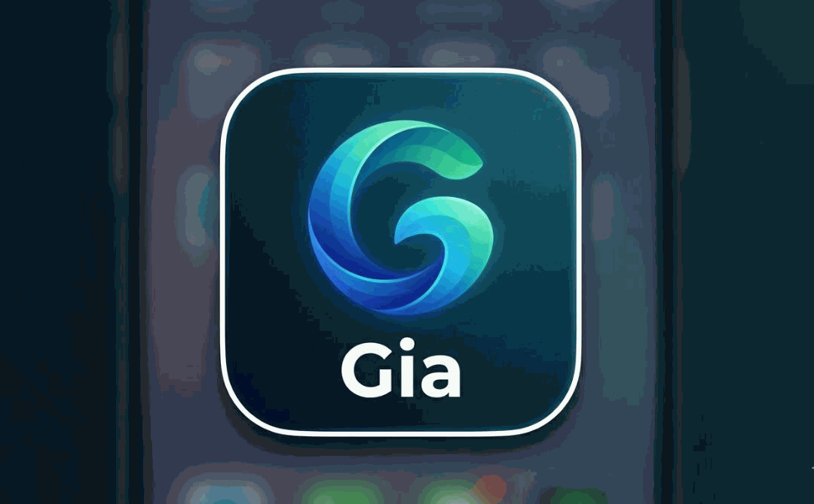

# GIA — Generative Interface Agent

GIA is a local-first AI workspace for chat, writing, analysis, planning, agents,
and device-aware workflows. Connect a cloud provider or use a supported local
model; when collaboration is enabled, GIA can send a request to up to three
configured cloud providers.

Part of the GIA family: [GIA Cowork](https://github.com/alpha-1-design/gia-cowork)
(desktop, real shell and screen control) · [GIA CLI](https://github.com/alpha-1-design/gia-cli)
(terminal coding agent).



[](https://github.com/alpha-1-design/gia-app/actions/workflows/ci.yml)
[](LICENSE)
[](package.json)
[](capacitor.config.ts)
[](https://react.dev/)
[](https://www.typescriptlang.org/)

## Start here

- [GIA manual](manual.md) — how to use the app and its modules.
- [Feature guides](docs/features/README.md) — focused guides for Chat, providers,
  Nexus, documents, privacy, and development.
- [Latest releases](https://github.com/alpha-1-design/gia-app/releases) — Android
  builds and release notes.
- [Report a bug](https://github.com/alpha-1-design/gia-app/issues/new/choose) · [Contributing](CONTRIBUTING.md)

## Explore GIA

| Chat and tools | Nexus agents |
| --- | --- |
|  |  |

| Analysis | Android sandbox |
| --- | --- |
|  |  |

## Feature guides

| Area | Guide |
| --- | --- |
| Chat, Prompt Studio, agents, collaboration | [Chat, templates, and agents](docs/features/chat-and-agents.md) |
| Model providers and multi-provider runs | [Providers and collaboration](docs/features/providers-and-collaboration.md) |
| Local custom agents and MCP servers | [Nexus and MCP](docs/features/nexus-and-mcp.md) |
| File attachments, PDF extraction, sandbox | [Documents and workspace](docs/features/documents-and-workspace.md) |
| Local data, cloud calls, Android and web | [Privacy and platforms](docs/features/privacy-and-platforms.md) |

## Development

Requires Node.js and npm. Install dependencies and start the development server:

```bash
npm ci --legacy-peer-deps
npm run dev
```

Run the checks before submitting changes:

```bash
npm run lint
npm run test:run
npm run build
```

See the [development guide](docs/features/development.md) for the architecture
map and Android sync command.

## License

GIA is distributed under the [Apache License 2.0](LICENSE).
