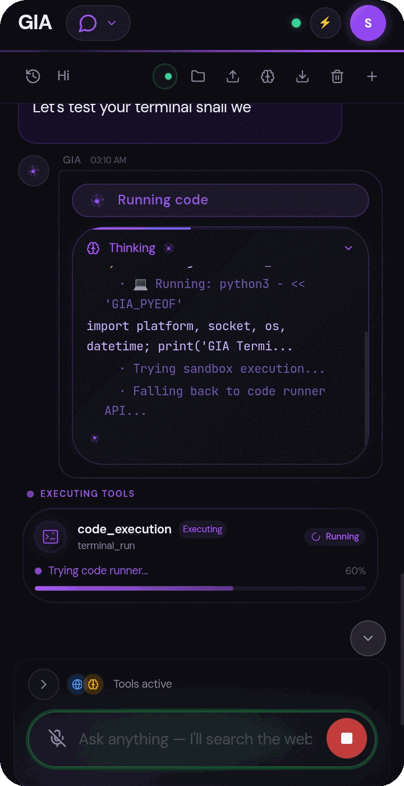

# Documents and workspace

GIA accepts image, PDF, and text-based attachments in Chat. Tap an attachment
chip in the composer to open a full-screen preview before sending; the preview
shows the extracted text attached to the message rather than running a second
parser in the UI, and images render at full size on a checkerboard backdrop.

For images, **Circle region** opens an edge-snapping selector — draw around one
part of the photo and GIA receives only that isolated region, which is useful for
pointing at a receipt line, a diagram, or a specific detail. The preview marks
annotated images as **Edited**; **Reset** restores the original and **Remove**
deletes the attachment.

## PDF handling

PDF text is extracted locally with PDF.js. Processing is bounded to PDFs no
larger than 50 MB, at most 250 pages, and at most 250,000 extracted characters.
When a document reaches a limit, GIA receives an explicit truncation note.
Encrypted, corrupted, or unsupported PDFs show an error instead of guessed text
from the raw PDF bytes. A PDF with no selectable text may be scanned or
image-only; OCR is not currently available in this Chat preview.

Text files are displayed as text, with long previews limited to the first 5,000
characters. Binary Office documents are not parsed directly as Chat
attachments yet; export them as PDF or plain text first. Unsupported or failed
attachments are identified in the composer and in the sent message, and GIA is
told when their contents were unavailable.

## Sandbox and generated files

GIA's optional terminal and sandbox tools run in the app's sandbox environment,
not on a remote host fallback. Generated files may be previewed in the app and
saved or downloaded. Native Android terminal setup and package installation
require the sandbox to be installed and can vary by device.

See the [GIA manual](../../manual.md) for additional document and terminal
workflows.
