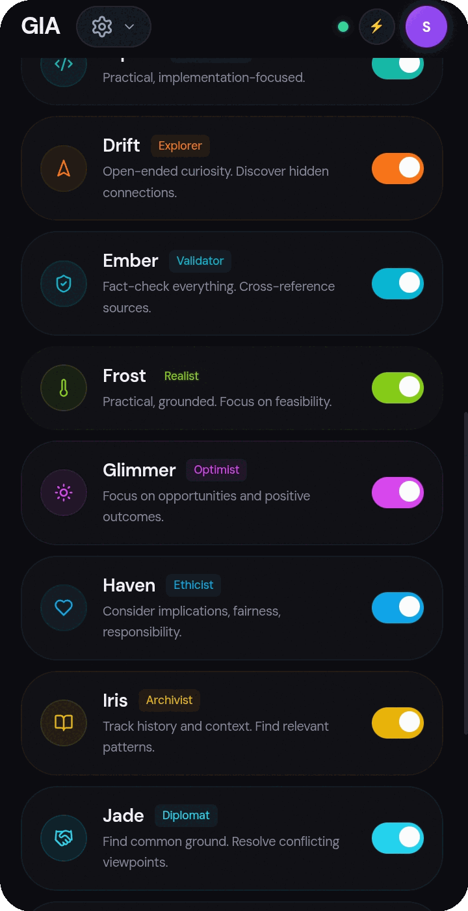

# Nexus and MCP

Nexus is GIA's specialist-agent coordination space. It shows task assignment,
agent progress, results, and synthesis for delegated work.

## Local custom agents

Create an agent in **Settings → Nexus** with a name, purpose, and instructions.
You can assign tools that are already connected to GIA, including MCP tools.
The agent profile is saved in local app state and is available to GIA's
delegation flow. It does not create or call a separate hosted agent service.

Tool assignment is a boundary, not a bypass: an agent can request only tools
made available to it, and tool calls continue through GIA's normal execution,
permission, and approval checks. Instructions in retrieved files or MCP results
are treated as untrusted data.

## MCP connections

Add and configure MCP servers in **Settings → MCP**, then connect or disconnect
them from Nexus. Nexus shows connection state and the tools made available by
connected servers. MCP servers are external services: connect only servers you
trust, and review the permissions and approval prompts before allowing actions.

1. Open **Settings → Nexus** to create a local agent or check a run.
2. Open **Settings → MCP** to configure a server.
3. Connect the server, then select its available tools for the local agent.
4. Ask GIA in Chat to delegate work to that agent.

For the main Chat experience, see [Chat, templates, and agents](./chat-and-agents.md).
